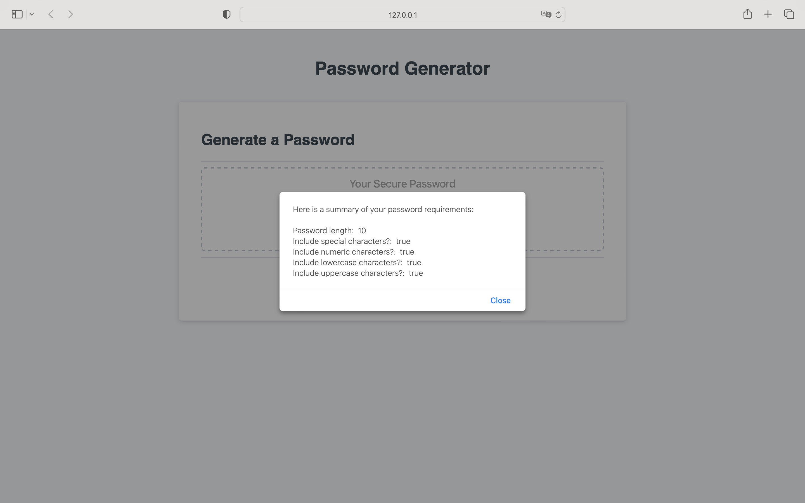

# Password-Generator


## Description

This password generator was created to randomly generate a password for an employee who handles sensitive data. This tool allows the user to select certain criteria for building a strong password which will provide greater security. 


## Requirements

The business requirements include the following:

GIVEN I need a new, secure password
- WHEN I click the button to generate a password THEN I am presented with a series of prompts for password criteria
- WHEN prompted for password criteria THEN I select which criteria to include in the password
- WHEN prompted for the length of the password THEN I choose a length of at least 8 characters and no more than 128 characters
- WHEN asked for character types to include in the password THEN I confirm whether or not to include lowercase, uppercase, numeric, and/or special characters
- WHEN I answer each prompt THEN my input should be validated and at least one character type should be selected
- WHEN all prompts are answered THEN a password is generated that matches the selected criteria
- WHEN the password is generated THEN the password is either displayed in an alert or written to the page


## Installation

N/A


## Deliverables

The password generator HTML can be found at ```./Develop/index.html``` with an accompanying CSS file at ```./Develop/style.css``` and a JS file at ```.Develop/script.js```.

The finished product can be found here: [https://japaricio98.github.io/Password-Generator/Develop/index.html](https://japaricio98.github.io/Password-Generator/Develop/index.html)

Screenshots of the finished product appear below.





## Credits

Juan Aparicio


## License 

MIT License
